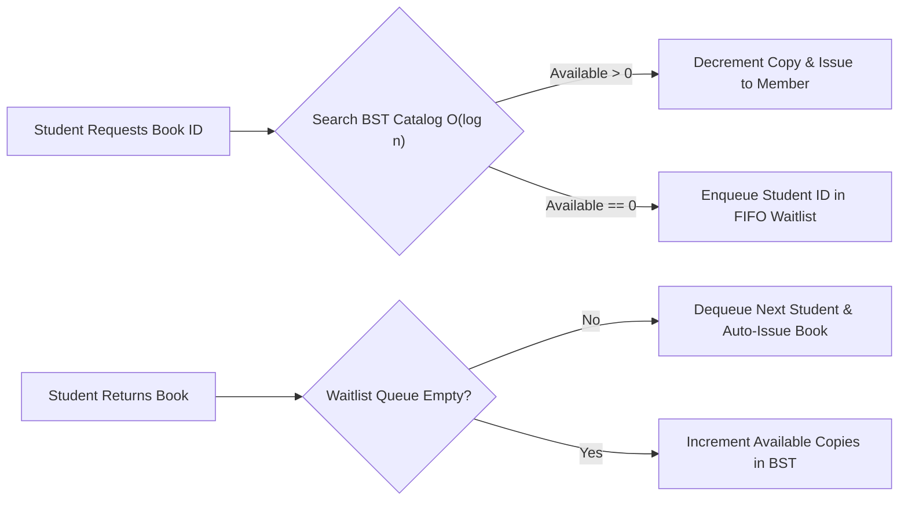

# Library Management System — C++ (PF & Data Structures)


A C++ **Library Management System** engineered using core **Programming Fundamentals (PF)** and **Data Structures & Algorithms (DSA)** concepts to manage book inventories, student/faculty members, borrowing lifecycles, reservation waitlists, and persistent CSV records.

---

## Data Structures & Algorithmic Complexity

| Module / Operation | Underlying Data Structure | Time Complexity (Avg) | Purpose |
| :--- | :--- | :---: | :--- |
| **Book Catalog & Lookup** | **Binary Search Tree (`BookNode*`)** | $\mathcal{O}(\log n)$ | Fast insertion, ISBN/ID search, and sorted in-order catalog printing |
| **Member Registry** | **Singly Linked List (`MemberNode*`)** | $\mathcal{O}(n)$ | Dynamic registration and active loan tracking without fixed array bounds |
| **Book Reservation Waitlist** | **FIFO Queue (`std::queue<int>`)** | $\mathcal{O}(1)$ | Fair first-come-first-served auto-assignment when a checked-out book is returned |
| **Transaction Audit Trail** | **LIFO Stack (`std::stack<string>`)** | $\mathcal{O}(1)$ | Chronological history of recent issue, return, and waitlist events |
| **Catalog Persistence** | **File Streams (`std::ofstream`)** | $\mathcal{O}(n)$ | Exports the sorted BST catalog to `catalog_export.csv` |

---

## System Workflow



---

## How to Compile & Run

```bash
g++ src/LibraryManagementSystem.cpp -o library_dsa
./library_dsa
```
